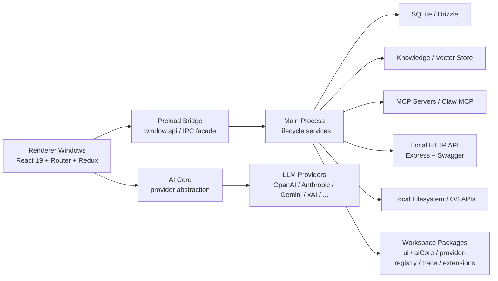

# Cherry Studio 系统架构

**日期：** 2026-05-29

## 1. 系统上下文

Cherry Studio 的运行中心是一个 Electron 桌面应用。它不只是一个“聊天界面”，而是一个本地应用平台，承担了这些职责：

- 桌面窗口与系统集成
- AI provider 调度与模型调用
- 用户业务数据持久化
- 知识库/RAG 处理
- MCP server 与代理工具能力
- 本地 HTTP API 暴露
- 多窗口 UI 与交互状态

## 2. 顶层架构图

## 3. 启动时序

项目把主进程启动分成三层术语，这一点在仓库里非常重要。

### preboot

发生在 `application.bootstrap()` 之前，位于 `src/main/core/preboot/`，负责：

- 解析用户数据目录
- 申请单实例锁
- 设置 Chromium flag
- 初始化 crash telemetry
- 处理 v1 -> v2 迁移门禁
- 初始化 path registry

这个阶段不能依赖 lifecycle service。

### bootstrap

由 `application.bootstrap()` 驱动，构建 IoC 容器并运行 lifecycle phases：

- `Background`
- `BeforeReady`
- `WhenReady`

主进程长期资源服务在这个阶段注册并启动。

### running

`bootstrap()` 完成后的稳定运行态。窗口、IPC、数据库、知识库、MCP、代理和 API server 都在这里工作。

## 4. 主进程架构

主进程位于 `src/main/`，是应用的系统中枢。

### 4.1 Core 基础设施

`src/main/core/` 不承载业务功能，而承载应用级基础能力：

- `application/`：Application singleton 与 service registry
- `lifecycle/`：依赖注入、生命周期、服务阶段控制
- `window/`：WindowManager 与窗口元数据
- `paths/`：统一路径注册表
- `logger/`：日志基础设施
- `preboot/`：启动前同步准备
- `job/`、`scheduler/`：任务与调度基础设施

### 4.2 生命周期服务

`src/main/core/application/serviceRegistry.ts` 注册了四十余个主进程服务。核心类型包括：

- 数据基础服务：`DbService`、`CacheService`、`PreferenceService`、`DataApiService`
- 窗口服务：`WindowManager`、`MainWindowService`、`SettingsWindowService`、`QuickAssistantService`
- 系统与平台服务：`TrayService`、`ShortcutService`、`ThemeService`、`ProxyManager`
- AI/业务服务：`McpService`、`SearchService`、`KnowledgeOrchestrationService`
- 代理与工具：`AgentBootstrapService`、`OpenClawService`、`CodeCliService`
- 扩展接口：`ApiServerService`、`NodeTraceService`、`WebviewService`

规则上，长期资源和持续副作用必须进入 lifecycle system；纯逻辑工具才允许用 direct-import singleton。

### 4.3 数据层

`src/main/data/` 是主进程数据管理实现，分为：

- `db/`：SQLite + Drizzle schema、seed、错误映射
- `api/`：DataApi 框架与 handler
- `services/`：业务服务层
- `migration/`：v2 数据迁移
- `CacheService.ts`
- `PreferenceService.ts`
- `DataApiService.ts`

这层既负责本地业务数据，也承接渲染层通过 IPC 发来的 DataApi 请求。

### 4.4 本地 HTTP API

`src/main/apiServer/` 提供本地 Express API，职责包括：

- OpenAI 兼容 `chat/completions`
- Anthropic 风格 `messages`
- MCP server 列表与详情
- Claw MCP over HTTP
- knowledge base 查询与搜索
- OpenAPI / Swagger 文档

这是对外可访问的本地接口面，与内部 DataApi 是两套不同边界。

### 4.5 知识库、文件与代理子系统

- `src/main/services/file/`：文件管理与目录树
- `src/main/services/fileProcessing/`：文件处理编排与 OCR/预处理
- `src/main/services/knowledge/`：知识库元数据、向量存储与工作流
- `src/main/services/agents/`：代理、session、task、skill、channel
- `src/main/mcpServers/`：内建 MCP server

这些子系统都在主进程，原因是它们依赖文件系统、数据库、长生命周期资源和外部进程。

## 5. 渲染层架构

渲染层位于 `src/renderer/`，本质是多个 React 应用入口共享同一套设计与数据访问模式。

### 5.1 多窗口结构

`src/renderer/windows/README.md` 定义了每个窗口的三层结构：

1. `entryPoint.tsx`：启动与挂载
2. `XxxApp.tsx`：Provider 根组件
3. 实际页面组件：语义命名

当前可见窗口入口包括：

- `main`
- `settings`
- `quickAssistant`
- `selection/action`
- `selection/toolbar`
- `trace`
- `migrationV2`
- `subWindow`

### 5.2 页面与组件组织

- `pages/`：按业务域划分页面，如 `agents`、`knowledge`、`files`、`translate`
- `components/`：大体量共享 UI 组件
- `store/`：Redux slice，承载消息、助手、设置、工具权限等 UI/运行态
- `data/`：`useQuery`、`useMutation`、`usePreference`、`useCache`
- `services/`：渲染层本地服务
- `workers/`：例如 Shiki、Pyodide 等 worker

### 5.3 UI 技术路线

渲染层当前是新旧 UI 路线共存：

- **目标路线：** `@cherrystudio/ui` + Tailwind v4 + Shadcn 风格组件
- **历史共存：** 仍保留一部分 `antd` 依赖和组件

仓库约束明确要求新 UI 优先走 `@cherrystudio/ui`。

## 6. Workspace 包架构

这些包不是外部微服务，而是桌面应用内部的功能分层。

| 包 | 作用 |
| --- | --- |
| `packages/ui` | 内部设计系统、组件、hooks、icons、theme token |
| `packages/aiCore` | 统一 AI provider 接口、插件系统、调用执行器 |
| `packages/ai-sdk-provider` | CherryIN provider bundle，适配 Vercel AI SDK |
| `packages/provider-registry` | provider / model 静态数据与 schema |
| `packages/extension-table-plus` | 基于 TipTap 的表格扩展 |
| `packages/mcp-trace` | trace-core / trace-node / trace-web |
| `packages/vectorstores/libsql` | libSQL 向量存储实现 |

这些包通过 Vite alias 与 workspace dependency 同时被主应用使用。

## 7. 数据架构

### 7.1 四套数据系统

Cherry Studio 明确区分四套数据系统：

- **BootConfig**：启动前同步配置
- **Cache**：可丢失或可重建的运行态数据
- **Preference**：稳定的用户设置
- **DataApi**：业务数据

这是代码导航时最重要的第一层判断，避免把所有状态都混到 Redux 或 SQLite 里。

### 7.2 SQLite / Drizzle

业务数据主要存放在 SQLite：

- schema 位于 `src/main/data/db/schemas/`
- migration 输出位于 `migrations/sqlite-drizzle/`
- 并发写需通过 `DbService.withWriteTx()`
- `message` 表配合 FTS5 虚表与 trigger 支持全文检索

### 7.3 文件与知识库

- `file_entry` / `file_ref` 管理文件实体与业务引用
- `knowledge_base` / `knowledge_item` 保存 durable metadata
- 向量索引与文档切块是服务层/运行态职责，不直接全部映射为传统关系表

## 8. API 与协议边界

项目同时存在三套重要接口面：

### 8.1 IPC / Preload API

`src/preload/index.ts` 暴露了大体量 `window.api`，涵盖：

- 应用/系统能力
- 文件与目录树
- preference / cache / dataApi
- knowledge base
- 窗口管理
- 代理与工具流
- trace / code CLI / OCR / OpenClaw / LAN 传输

这是渲染层访问主进程的主通道。

### 8.2 DataApi

这是内部业务 API，schema 在 `src/shared/data/api/schemas/`，由渲染层 hooks 通过 IPC 驱动，不是对外 HTTP API。

### 8.3 本地 HTTP API / MCP

`src/main/apiServer/` 与 `src/main/mcpServers/` 对外暴露标准化接口，适合外部脚本、兼容层、代理客户端或工具链接入。

## 9. 测试与质量门

项目的质量门较重，核心命令包括：

- `pnpm lint`
- `pnpm test`
- `pnpm format`
- `pnpm build:check`
- `pnpm ci`

测试层级包括：

- 主进程 / 渲染层 / shared / aiCore / vectorstores 单测
- API route/middleware 测试
- Playwright E2E
- `tests/__mocks__` 统一 mock 系统

## 10. 当前架构约束与风险

### 10.1 v2 重构尚未完成

- 旧数据栈和新数据栈仍有共存痕迹
- 一些参考文档描述的是目标态，而不是完全落地后的最终态

### 10.2 渲染层 UI 仍有双栈

- 新代码应走 `@cherrystudio/ui`
- 仓库里仍存在 `antd` 依赖和历史页面

### 10.3 preload API 体积较大

- `src/preload/index.ts` 暴露面非常宽
- 这对功能开发友好，但也意味着边界治理和安全审查要更严格

### 10.4 API server 仍有历史耦合

- `createApp()` 工厂自身就标记了 timing workaround 注释
- API server 子系统仍有进一步解耦空间

## 11. 扩展时的优先入口

- 新主进程服务：`src/main/services/` + `serviceRegistry.ts`
- 新数据实体：`src/main/data/db/schemas/` + `src/shared/data/api/schemas/`
- 新窗口：`src/renderer/windows/`
- 新 UI 组件：优先 `packages/ui`，其次 `src/renderer/components`
- 新 provider / model 数据：`packages/provider-registry`
- 新 AI 调用扩展：`packages/aiCore`

---

这份架构文档的核心价值，不是枚举每个目录，而是帮助你先判断“改动应该落在哪一层、通过什么边界通信、遵守哪类基础约束”。
