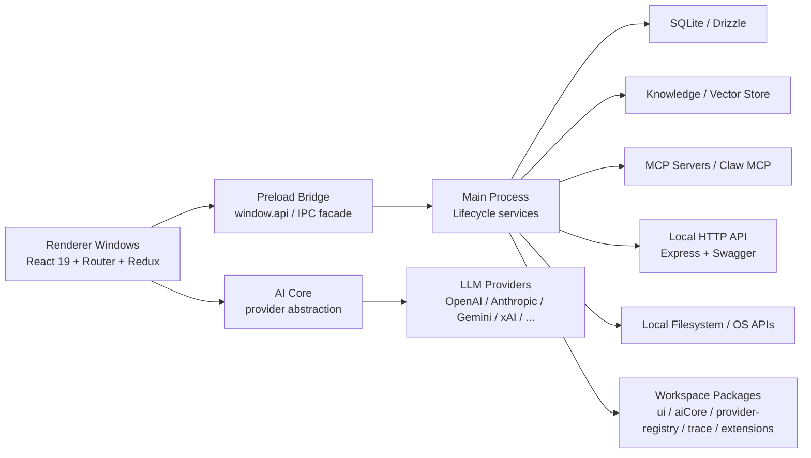

# Cherry Studio 系统架构

**日期：** 2026-05-29

## 1. 系统上下文

Cherry Studio 的运行中心是一个 Electron 桌面应用。它不只是一个“聊天界面”，而是一个本地应用平台，承担了这些职责：

- 桌面窗口与系统集成
- AI provider 调度与模型调用
- 用户业务数据持久化
- 知识库/RAG 处理
- MCP server 与代理工具能力
- 本地 HTTP API 暴露
- 多窗口 UI 与交互状态

## 2. 顶层架构图

## 3. 启动时序

项目把主进程启动分成三层术语，这一点在仓库里非常重要。

### preboot

发生在 `application.bootstrap()` 之前，位于 `src/main/core/preboot/`，负责：

- 解析用户数据目录
- 申请单实例锁
- 设置 Chromium flag
- 初始化 crash telemetry
- 处理 v1 -> v2 迁移门禁
- 初始化 path registry

这个阶段不能依赖 lifecycle service。

启动红线：

- `preboot` 只做同步的环境探测、路径准备、轻量配置和迁移门禁，不能启动长期资源。
- `preboot` 不能读取或注入 lifecycle service；需要服务能力的逻辑必须后移到 `bootstrap` 或 `running`。
- 这个阶段产生的路径只能进入统一 path registry，后续主进程代码通过 `application.getPath()` 读取。

### bootstrap

由 `application.bootstrap()` 驱动，构建 IoC 容器并运行 lifecycle phases：

- `Background`
- `BeforeReady`
- `WhenReady`

主进程长期资源服务在这个阶段注册并启动。

生命周期红线：

- 持有长期资源、IPC 监听器、定时器、外部进程或持续副作用的主进程能力必须注册为 lifecycle service。
- lifecycle service 必须声明所属 phase、依赖关系和 stop/dispose 路径；退出、重启、切换运行状态时不能留下悬挂资源。
- `@DependsOn` 只表达同阶段服务依赖；`BeforeReady` 到 `WhenReady` 的阶段顺序由容器保证，不需要重复声明。

### running

`bootstrap()` 完成后的稳定运行态。窗口、IPC、数据库、知识库、MCP、代理和 API server 都在这里工作。

## 4. 主进程架构

主进程位于 `src/main/`，是应用的系统中枢。

### 4.1 Core 基础设施

`src/main/core/` 不承载业务功能，而承载应用级基础能力：

- `application/`：Application singleton 与 service registry
- `lifecycle/`：依赖注入、生命周期、服务阶段控制
- `window/`：WindowManager 与窗口元数据
- `paths/`：统一路径注册表
- `logger/`：日志基础设施
- `preboot/`：启动前同步准备
- `job/`、`scheduler/`：任务与调度基础设施

### 4.2 生命周期服务

`src/main/core/application/serviceRegistry.ts` 注册了四十余个主进程服务。核心类型包括：

- 数据基础服务：`DbService`、`CacheService`、`PreferenceService`、`DataApiService`
- 窗口服务：`WindowManager`、`MainWindowService`、`SettingsWindowService`、`QuickAssistantService`
- 系统与平台服务：`TrayService`、`ShortcutService`、`ThemeService`、`ProxyManager`
- AI/业务服务：`McpService`、`SearchService`、`KnowledgeOrchestrationService`
- 代理与工具：`AgentBootstrapService`、`OpenClawService`、`CodeCliService`
- 扩展接口：`ApiServerService`、`NodeTraceService`、`WebviewService`

规则上，长期资源和持续副作用必须进入 lifecycle system；纯逻辑工具才允许用 direct-import singleton。

服务规则：

- 主进程服务通过 `application.get('ServiceName')` 访问，业务代码不手写 `new` 或自建 singleton。
- 主进程文件路径必须通过 `application.getPath('namespace.key', filename?)` 获取，不直接调用 `app.getPath()`、`os.homedir()` 或拼接用户目录。
- 日志必须通过 `loggerService.withContext()` 输出；常规服务不直接使用 `console.log`。
- 窗口创建、复用、关闭和生命周期事件必须经 `WindowManager` 及窗口注册表，不在业务服务里散落持有 `BrowserWindow`。

### 4.3 数据层

`src/main/data/` 是主进程数据管理实现，分为：

- `db/`：SQLite + Drizzle schema、seed、错误映射
- `api/`：DataApi 框架与 handler
- `services/`：业务服务层
- `migration/`：v2 数据迁移
- `CacheService.ts`
- `PreferenceService.ts`
- `DataApiService.ts`

这层既负责本地业务数据，也承接渲染层通过 IPC 发来的 DataApi 请求。

### 4.4 本地 HTTP API

`src/main/apiServer/` 提供本地 Express API，职责包括：

- OpenAI 兼容 `chat/completions`
- Anthropic 风格 `messages`
- MCP server 列表与详情
- Claw MCP over HTTP
- knowledge base 查询与搜索
- OpenAPI / Swagger 文档

这是对外可访问的本地接口面，与内部 DataApi 是两套不同边界。

### 4.5 知识库、文件与代理子系统

- `src/main/services/file/`：文件管理与目录树
- `src/main/services/fileProcessing/`：文件处理编排与 OCR/预处理
- `src/main/services/knowledge/`：知识库元数据、向量存储与工作流
- `src/main/services/agents/`：代理、session、task、skill、channel
- `src/main/mcpServers/`：内建 MCP server

这些子系统都在主进程，原因是它们依赖文件系统、数据库、长生命周期资源和外部进程。

这些子系统对外暴露能力时应经过明确的 service facade。HTTP、MCP、preload 或渲染层调用不能直接触碰数据库连接、文件系统路径、窗口对象或 lifecycle internals。

## 5. 渲染层架构

渲染层位于 `src/renderer/`，本质是多个 React 应用入口共享同一套设计与数据访问模式。

### 5.1 多窗口结构

`src/renderer/windows/README.md` 定义了每个窗口的三层结构：

1. `entryPoint.tsx`：启动与挂载
2. `XxxApp.tsx`：Provider 根组件
3. 实际页面组件：语义命名

当前可见窗口入口包括：

- `main`
- `settings`
- `quickAssistant`
- `selection/action`
- `selection/toolbar`
- `trace`
- `migrationV2`
- `subWindow`

窗口规则：

- 渲染层只表达打开、关闭、聚焦等交互意图，不直接拥有窗口生命周期。
- 新窗口类型必须先在 `src/main/core/window/windowRegistry.ts` 声明 lifecycle 模式，再通过 `WindowManager.open()` / `close()` 使用。
- 窗口初始化数据由窗口管理链路传递，渲染层不假设底层 `BrowserWindow` 实例存在。

### 5.2 页面与组件组织

- `pages/`：按业务域划分页面，如 `agents`、`knowledge`、`files`、`translate`
- `components/`：大体量共享 UI 组件
- `store/`：Redux slice，承载消息、助手、设置、工具权限等 UI/运行态
- `data/`：`useQuery`、`useMutation`、`usePreference`、`useCache`
- `services/`：渲染层本地服务
- `workers/`：例如 Shiki、Pyodide 等 worker

访问规则：

- 渲染层访问主进程能力只能通过受控 preload/API 边界，不能 import main-only service、Electron API 或 Node.js 底层能力。
- 业务数据走 `data/` 下的 `useQuery` / `useMutation`；用户设置和运行态状态分别走 `usePreference`、`useCache` 等既有入口。

### 5.3 UI 技术路线

渲染层当前是新旧 UI 路线共存：

- **目标路线：** `@cherrystudio/ui` + Tailwind v4 + Shadcn 风格组件
- **历史共存：** 仍保留一部分 `antd` 依赖和组件

仓库约束明确要求新 UI 优先走 `@cherrystudio/ui`。

新 UI 默认使用 `@cherrystudio/ui` 和 Tailwind/Shadcn 路线。`antd` 属于历史共存栈，新页面和新共享组件不应继续扩大它的使用范围；旧页面维护时也应避免把 `antd` 包装成新的跨域基础组件。

## 6. Workspace 包架构

这些包不是外部微服务，而是桌面应用内部的功能分层。

| 包 | 作用 |
| --- | --- |
| `packages/ui` | 内部设计系统、组件、hooks、icons、theme token |
| `packages/aiCore` | 统一 AI provider 接口、插件系统、调用执行器 |
| `packages/ai-sdk-provider` | CherryIN provider bundle，适配 Vercel AI SDK |
| `packages/provider-registry` | provider / model 静态数据与 schema |
| `packages/extension-table-plus` | 基于 TipTap 的表格扩展 |
| `packages/mcp-trace` | trace-core / trace-node / trace-web |
| `packages/vectorstores/libsql` | libSQL 向量存储实现 |

这些包通过 Vite alias 与 workspace dependency 同时被主应用使用。

## 7. 数据架构

### 7.1 四套数据系统

Cherry Studio 明确区分四套数据系统：

- **BootConfig**：启动前同步配置
- **Cache**：可丢失或可重建的运行态数据
- **Preference**：稳定的用户设置
- **DataApi**：业务数据

这是代码导航时最重要的第一层判断，避免把所有状态都混到 Redux 或 SQLite 里。

边界判断：

- **BootConfig** 是启动前同步配置，只保存 pre-lifecycle 必须读取的少量设置。
- **Cache** 保存可丢失、可重建或跨窗口协调的运行态数据，不作为业务真相来源。
- **Preference** 保存稳定用户设置，不承载可无限增长的业务实体。
- **DataApi** 只服务 SQLite-backed business data；没有数据库表或 CRUD 语义的能力不应包装成 DataApi endpoint。

### 7.2 SQLite / Drizzle

业务数据主要存放在 SQLite：

- schema 位于 `src/main/data/db/schemas/`
- migration 输出位于 `migrations/sqlite-drizzle/`
- 并发写需通过 `DbService.withWriteTx()`
- `message` 表配合 FTS5 虚表与 trigger 支持全文检索

写入规则：

- 涉及并发或多表一致性的写路径必须进入 `application.get('DbService').withWriteTx(fn)`，不直接使用裸 `db.transaction(fn)`。
- repository/service 测试需要覆盖失败回滚和并发冲突；不能只验证成功写入路径。
- v2 重构期间，`migrations/sqlite-drizzle/` 是可重生的开发产物，最终清理前不应把中间 SQL 当成稳定架构承诺。

### 7.3 文件与知识库

- `file_entry` / `file_ref` 管理文件实体与业务引用
- `knowledge_base` / `knowledge_item` 保存 durable metadata
- 向量索引与文档切块是服务层/运行态职责，不直接全部映射为传统关系表

文件实体、知识库元数据可以进入 DataApi；文件系统访问、OCR/预处理任务、向量索引构建和外部进程编排仍属于主进程服务职责，不应为了统一入口而塞进 DataApi。

## 8. API 与协议边界

项目同时存在三套重要接口面：

### 8.1 IPC / Preload API

`src/preload/index.ts` 暴露了大体量 `window.api`，涵盖：

- 应用/系统能力
- 文件与目录树
- preference / cache / dataApi
- knowledge base
- 窗口管理
- 代理与工具流
- trace / code CLI / OCR / OpenClaw / LAN 传输

这是渲染层访问主进程的主通道。

preload 规则：

- `window.api` 是受控桥接层，不是业务编排层；新增能力应优先复用已有 service facade。
- 新增 preload API 必须有明确命名空间、输入输出类型、错误语义和调用方边界。
- preload 不直接暴露数据库连接、原始文件路径、窗口对象或 lifecycle internals。
- renderer 不能绕过 preload 直接访问 Node.js、Electron 或主进程内部模块。

### 8.2 DataApi

这是内部业务 API，schema 在 `src/shared/data/api/schemas/`，由渲染层 hooks 通过 IPC 驱动，不是对外 HTTP API。

DataApi 的 schema、handler、service、repository 必须对应 SQLite-backed business data。外部服务调用、窗口控制、文件系统副作用、协议适配和一次性命令应保留在 IPC/service 边界，而不是伪装成 DataApi。

### 8.3 本地 HTTP API / MCP

`src/main/apiServer/` 与 `src/main/mcpServers/` 对外暴露标准化接口，适合外部脚本、兼容层、代理客户端或工具链接入。

HTTP / MCP 规则：

- 本地 HTTP API 是外部客户端和兼容层的访问边界；MCP 是工具协议适配边界，二者不能绕过主进程 service facade 直接访问底层资源。
- 新增 HTTP/MCP 能力必须定义 owner、输入输出 schema、错误格式、超时/取消策略和权限边界。
- 需要访问业务数据时，应通过既有 service/repository 组合；不直接复用 renderer DataApi hook，也不直接操作窗口对象或 lifecycle internals。

## 9. 测试与质量门

项目的质量门较重，核心命令包括：

- `pnpm lint`
- `pnpm test`
- `pnpm format`
- `pnpm build:check`
- `pnpm ci`

测试层级包括：

- 主进程 / 渲染层 / shared / aiCore / vectorstores 单测
- API route/middleware 测试
- Playwright E2E
- `tests/__mocks__` 统一 mock 系统

按边界验证：

| 边界 | 必须验证的规则 | 证据 |
| --- | --- | --- |
| 启动生命周期 | `preboot` 不依赖 lifecycle service；长期资源由 lifecycle 托管 | 启动顺序测试、依赖扫描、初始化失败回归用例 |
| 主进程服务 | 路径走 `application.getPath()`；日志走 `loggerService`；资源有 stop/dispose 路径 | 单测、集成测试、静态搜索检查 |
| 数据写入 | SQLite-backed business data 才走 DataApi；并发写走 `DbService.withWriteTx()` | repository/service 测试、并发写测试、事务失败回滚测试 |
| IPC / preload | preload 只暴露受控 API；renderer 不直接访问主进程内部服务 | IPC contract 测试、暴露面快照、负向用例 |
| HTTP / MCP | 协议入口不绕过权限、schema、错误处理和 service facade | contract 测试、错误码/异常路径测试 |
| 窗口管理 | 新窗口必须经 `WindowManager` 和窗口注册表 | 静态扫描、窗口生命周期测试、多窗口 smoke test |
| UI 路线 | 新 UI 使用 `@cherrystudio/ui`，不扩大历史 `antd` 依赖 | 代码评审检查、组件入口扫描、关键路径 UI 回归 |
| v2 迁移态 | v1 数据栈和中间 drizzle SQL 不作为新功能稳定扩展面 | 依赖新增检查、迁移/删除影响测试 |

凡修改启动、主进程服务、DataApi、IPC/preload、窗口、HTTP/MCP 或 UI 基础组件的 PR，都应说明受影响边界和对应验证方式。边界例外需要写清 owner、理由、影响范围和测试覆盖。

## 10. 当前架构约束与风险

### 10.1 v2 重构尚未完成

- 旧数据栈和新数据栈仍有共存痕迹
- 一些参考文档描述的是目标态，而不是完全落地后的最终态
- 新逻辑不应继续扩大 Redux、Dexie、ElectronStore 等 v1 数据栈依赖；必须先判断目标状态属于 Cache、Preference、BootConfig 还是 DataApi。
- `migrations/sqlite-drizzle/` 当前是可重构开发产物，遇到 schema 调整优先回到 schema 源头和生成流程，而不是手写补丁 SQL 固化中间状态。

### 10.2 渲染层 UI 仍有双栈

- 新代码应走 `@cherrystudio/ui`
- 仓库里仍存在 `antd` 依赖和历史页面
- 新页面、新共享组件和跨页面基础组件不应新增 `antd` 依赖；旧页面维护时也避免把 `antd` 包装成新的公共接口。
- 如果一次改动跨越新旧 UI 栈，需要在 PR 中说明保留旧栈的原因、迁移边界和回归验证范围。

### 10.3 preload API 体积较大

- `src/preload/index.ts` 暴露面非常宽
- 这对功能开发友好，但也意味着边界治理和安全审查要更严格
- 新增 preload 能力时先确认是否已有 DataApi、Preference、Cache、WindowManager 或 service facade 可复用。
- 若需要新增入口，必须收窄命名空间、参数类型、错误语义和权限范围，避免把底层 DB、文件路径、窗口对象直接暴露给 renderer。

### 10.4 API server 仍有历史耦合

- `createApp()` 工厂自身就标记了 timing workaround 注释
- API server 子系统仍有进一步解耦空间
- 新增 HTTP route 或 MCP tool 时，不应复制历史耦合；入口只做协议适配，业务能力回到主进程 service/repository。
- 如果修改启动时序、端口绑定或资源持有方式，需要补启动/停止、端口占用、错误响应和资源释放验证。

## 11. 扩展时的优先入口

扩展时每个入口都要先回答：应该落在哪个边界、不能绕过哪个基础设施、最低验证是什么。

- 新主进程服务：入口是 `src/main/services/` + `serviceRegistry.ts`；确认是否持有长期资源；长期资源进入 lifecycle；使用 `application.getPath()` 和 `loggerService`；验证 start/stop、错误路径和资源释放。
- 新数据实体：入口是 `src/main/data/db/schemas/` + `src/shared/data/api/schemas/`；确认是 SQLite-backed business data；新增 schema、DataApi schema、handler/service/repository；写路径经 `DbService.withWriteTx()`；验证迁移、并发写和失败回滚。
- 新窗口：入口是 `src/renderer/windows/` + `src/main/core/window/windowRegistry.ts`；先声明窗口类型和 lifecycle 模式；通过 `WindowManager.open()` / `close()` 使用；渲染层只读取初始化数据并表达交互意图；验证窗口创建、复用、关闭和多窗口状态。
- 新 UI 组件：入口优先是 `packages/ui`，其次是 `src/renderer/components`；避免新增 `antd` 或跨栈包装；验证组件行为、主题/密度适配和关键页面回归。
- 新 provider / model 数据：入口是 `packages/provider-registry`；保持静态 provider/model 数据与调用逻辑分离；验证 schema、默认值和消费端兼容。
- 新 AI 调用扩展：入口是 `packages/aiCore`；落在 provider abstraction、middleware 或执行器边界；不要把 provider 调用细节散落到页面组件；验证流式响应、错误、取消和工具调用路径。
- 新 HTTP API / MCP 能力：入口只做协议适配，业务逻辑回到主进程 service facade；定义 owner、schema、错误和超时/取消策略；验证 contract、异常路径和资源释放。

---

这份架构文档的核心价值，不是枚举每个目录，而是帮助你先判断“改动应该落在哪一层、通过什么边界通信、遵守哪类基础约束”。
