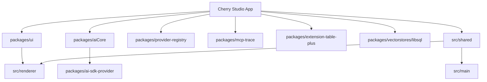

# Cherry Studio 集成架构

**日期：** 2026-05-29

## 1. 集成视角

Cherry Studio 的“集成”不是传统的前后端 RPC，而是多种本地边界同时存在：

- Renderer <-> Main 通过 IPC/preload
- Main <-> SQLite 通过 Drizzle
- Main <-> 本地 HTTP API 通过 Express
- Main <-> MCP server / agent transport
- Main <-> 文件系统 / OS / 外部 provider
- Renderer <-> 内部 workspace 包

因此最有用的架构问题通常不是“前端怎么调后端”，而是“某个能力应该通过哪条边界进入系统”。

## 2. 主要集成路径

### 2.1 渲染层到主进程

路径：

`React UI -> hooks/store -> window.api -> ipcRenderer -> main handlers/services`

典型场景：

- 设置项写入
- 文件选择与读写
- 知识库导入
- 代理会话流订阅
- OpenClaw 网关管理

### 2.2 渲染层到数据持久化

路径：

`useQuery/useMutation -> DataApi IPC -> main DataApi -> service/repository -> SQLite`

适用于：

- topics/messages
- assistants
- files
- agents
- jobs

### 2.3 渲染层到 AI provider

路径：

`UI interaction -> renderer ai logic -> @cherrystudio/ai-core -> provider adapters -> upstream model API`

其中 provider 元数据还会结合：

- `packages/provider-registry`
- 用户 provider/model 配置

### 2.4 本地 HTTP API 到内部系统

路径：

`HTTP request -> Express route -> api service -> provider/data/service layer`

适用于：

- OpenAI 兼容聊天
- Anthropic 风格消息接口
- MCP server 信息查询
- knowledge base 检索

### 2.5 MCP / Agent 通道

路径：

`MCP client or session -> transport -> main mcp/agent service -> tools / channels / tasks / sessions`

其中 `claw-mcp` 路由是典型 session transport。

## 3. Workspace 包集成关系

### 关键关系

- `packages/ui` 被 renderer 直接消费
- `packages/aiCore` 被 renderer AI 流程消费
- `packages/provider-registry` 为主应用提供静态 provider/model 数据
- `packages/mcp-trace` 横跨主进程与渲染层
- `src/shared` 是主应用内部比 workspace 包更接近“契约层”的共享模块

## 4. 本地系统集成

### 文件系统

主进程通过 file manager、directory tree、fs utilities 与本地文件系统集成。

### 桌面系统

包括：

- 系统字体
- 剪贴板/选区
- 快捷键
- 托盘
- 窗口管理
- 开机启动
- macOS 权限

### 外部网络服务

包括：

- 各类 LLM provider
- WebDAV / S3 / 局域网备份
- Web search provider
- OpenClaw / 外部工具链

## 5. 关键耦合点

### 5.1 `src/shared`

这是最高频、最隐式的耦合点。很多看似“只是主进程改动”的功能，实际上还要同步：

- preference key
- dataApi schema
- file handle / ipc type
- provider config type

### 5.2 Preload API

`src/preload/index.ts` 是 renderer-main 集成的超大门面。任何主进程能力想被 UI 使用，通常都要经过这里。

### 5.3 Service Registry

新主进程能力若属于长期资源服务，最终都要通过 `serviceRegistry.ts` 加入主应用生命周期。

### 5.4 Provider / Model 配置链

一项模型能力变更可能涉及：

- 静态 provider registry
- 用户 provider/model 数据
- aiCore 运行时选择逻辑
- UI 模型选择组件
- 本地 HTTP API 兼容层

## 6. 典型扩展路径示例

### 新增一个业务实体

通常会波及：

- DB schema
- shared DataApi schema
- main data handler/service
- renderer hooks / UI
- tests

### 新增一个桌面工具能力

通常会波及：

- 主进程 service
- preload API
- 渲染层调用入口
- 可能的设置项与日志

### 新增一个 provider 功能

通常会波及：

- provider registry
- aiCore/provider adapter
- user provider/model 设置
- UI 展示能力
- 可能的 HTTP API 兼容逻辑

## 7. 最常见的边界错误

- 把无 DB 支撑的副作用接口做成 DataApi
- 在 renderer 直接假设主进程实现细节
- 在主进程新增能力却忘了 preload 暴露或 shared 契约
- 把设计系统层和应用业务层组件混在一起扩展

---

这份集成架构文档适合在“我要改这项能力，但还不确定会牵动哪些层”时先看一遍。
